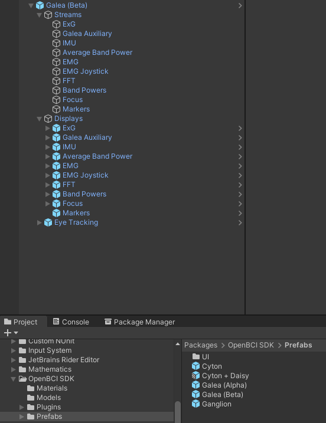

# OpenBCI Unity SDK

The OpenBCI Unity SDK is a toolkit for building applications that interface with the Galea headset and other OpenBCI products in Unity. This software is distributed as a [custom Unity package](https://docs.unity3d.com/Manual/PackagesList.html) and includes several utilities:

- Tools for streaming data from the OpenBCI GUI and Galea GUI
- Eye tracking tools and metrics
- Scripts for sending and receiving markers

# Installation

Add this package to a new or existing project according to the instructions for [installing a Unity package from a tarball](https://docs.unity3d.com/Manual/upm-ui-tarball.html).

Ensure you are using Unity 2020.2 or newer with the Universal Rendering Pipeline (only required for UI elements).

# Getting Started

If you are using a Galea Alpha or Galea Beta headset, follow the instructions on [Getting Started with the Varjo XR Plugin for Unity](https://developer.varjo.com/docs/unity-xr-sdk/getting-started-with-varjo-xr-plugin-for-unity).

Prefabs are provided that include all the components necessary to connect with the OpenBCI networking widget for each of the devices supported by OpenBCI.

To stream biometric data into a project:

1. Determine the type of Device you are using (_Galea Beta_, _Galea Alpha_, _Cyton + Daisy_, _Cyton_, or _Ganglion_).
2. Drag a copy of the prefab for that device into the scene. If you are prompted to install TMP Essentials, click yes, delete the prefab, and re-add it to the scene.
3. Start the [OpenBCI GUI](https://openbci.com/downloads) or Galea GUI and connect to the device.
4. Configure the Networking Widget to stream the data types you are interested in. Make sure the port on the Unity prefab and Networking Widget stream match. This is configured by default in newer versions of the GUIs.
5. Enter _Play Mode_ and observe the metrics being streamed in the example displays.

Project scripts can add references to the components in the **Streams** hierarchy to gain access to the biometric data. Eye tracking for the Galea devices is a separate component and is discussed in detail in the [Eye Tracking](#eye-tracking) section.

# Metrics

Biometrics are provided as part of the device prefabs and are organized into separate GameObjects. Each metric GameObject can be enabled or disabled as needed. Disabling unnecessary metrics may help improve performance and reduce the computational load of the application.

## Eye Tracking

This metric provides utilities that wrap functionality provided by the [Varjo Native SDK](https://developer.varjo.com/docs/native/varjo-native-sdk).

The `EyeGazeManager` script determines if any scripts implementing `IGazeTarget` are currently being looked at. The script also provides values for the current _pupil size_, _iris size_ and _openness_ for each eye.

Scripts can react to being looked at by implementing the `IGazeTarget` interface. These scripts should be added to a `GameObject` that also has a [`Collider`](https://docs.unity3d.com/Manual/CollidersOverview.html) on a [layer that can interact](https://docs.unity3d.com/Manual/LayerBasedCollision.html) with the `EyeGazeManager`. When the user gazes at an object with an IGazeTarget component, the `IGazeTarget::StartGaze()` method will be invoked. When the user stops gazing at the object, the `IGazeTarget::StopGaze()` method will be invoked.

The **Eye Fixation Point** GameObject can be optionally enabled (e.g. during development) to visualize where the user is looking.

# Markers

Markers can be used to make note of important events during an experiment or session. Markers are organized on a specialized data channel that is recorded alongside other biosensor data in the OpenBCI GUI and Galea GUI.

## Sending Markers

The OpenBCI Unity SDK provides an abstract base `Marker` class that can be extended as required to create custom marking capabilities. Several example markers are included:

- `CollisionMarker` - Inserts a marker when it is collided with
- `EyeGazeMarker` - Inserts markers when it is looked at and looked away from
- `ToggleMarker` - A simple marker that can be manually or programmatically used to add a marker by enabling or disabling the behaviour.

When using a marker, ensure that the port is set to the same value in both Unity and the OpenBCI GUI / Galea GUI marker widget.

## Receiving Markers

Markers received from the OpenBCI GUI will be consumed by the `MarkerStream` script. This script exposes events to which client classes should subscribe in order to dynamically respond to received markers.

# Troubleshooting

- If the application appears frozen, click on the Unity [Game View](https://docs.unity3d.com/Manual/GameView.html). Unity requires the Game View to be focused by default in order to run applications. You can change this setting by navigating to _Edit_ -> _Project Settings_ -> _Player_ -> _Resolution and Presentation_ and ensuring the _Run In Background_ option is checked.
- If the height of an example or your application looks strange, try running the [SteamVR room setup](https://varjo.com/use-center/get-started/varjo-headsets/setting-up-tracking/steamvr-tracking/).
- When using a Varjo-based headset, ensure that all interaction with SteamVR is done through the [Varjo Base](https://varjo.com/use-center/get-to-know-your-headset/using-varjo-base/) application. Launching SteamVR directly will generate conflicts with the specialized version of SteamVR used by Varjo.
- If you see connection issues in Varjo Base when using a Varjo-based headset, ensure that the letters on the headset USB-C cable match with the letters on the ports on the headset and computer connectors. Also ensure that the connector is plugged into a USB-C PD port if using the Varjo laptop adapter.
